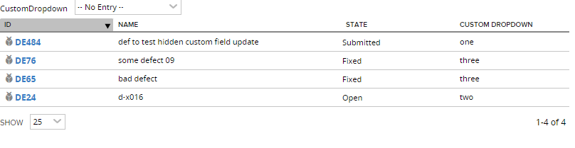

Update defect State based on Custom Field value
=========================

## Overview
CAUTION: This app will change your data.
Initially run this app in the sandbox/playground workspace designated for testing only to make sure that it does what you expect!

In this example a custom field of dropdown type exists on Defects, with the following values:

The grid is filterd by LastUpdateDate (looking back 30 days) and by CustomDropdown that is not null:

The grid may further be filterd by specific CustomDropdown value:

When "Update" button is clicked, the defect State is updated based on selection in the CustomDropdown.

State is changed to "Submitted" if CustomDropdown="one"

State is changed to "Open" if CustomDropdown="two"

State is changed to "Fixed" if CustomDropdown="three"

State is changed to "Closed" if CustomDropdown="four"

Refresh the browser to see changes.

This few second video captures how the app works:
http://screencast.com/t/BicZTfpaHZSz

To run the app in your environment modify it to work with your custom field and its values:

 - replace 'c_CustomDropdown' with the name of your custom field,
 - modify hardcoded values in '_onDataLoaded' in if/else block

The app is vailable AS IS. It is NOT supported by Rally.
## License

AppTemplate is released under the MIT license.  See the file [LICENSE](./LICENSE) for the full text.

##Documentation for SDK

You can find the documentation on our help [site.](https://help.rallydev.com/apps/2.0rc3/doc/)
